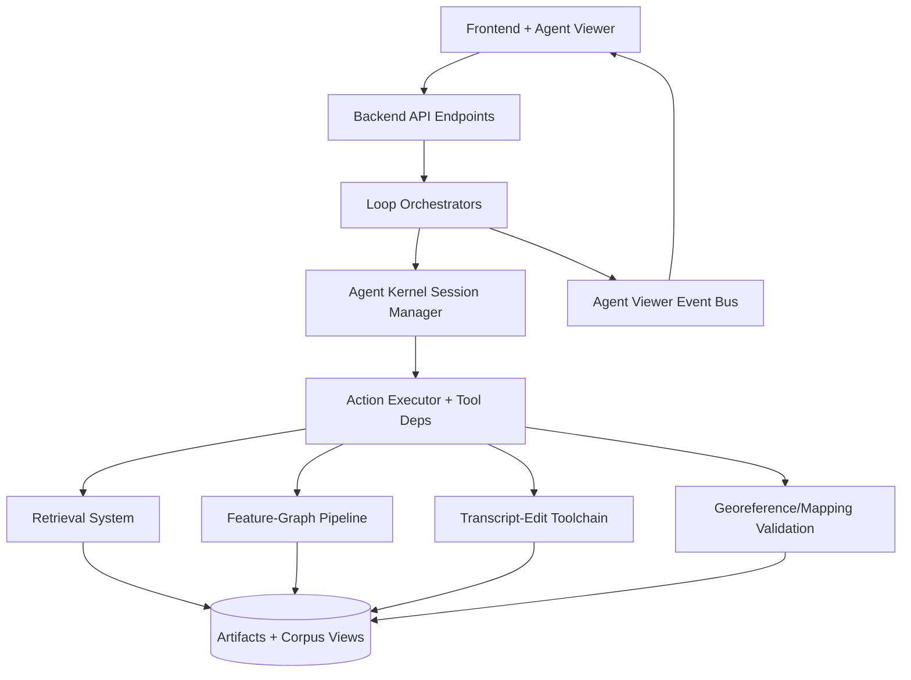
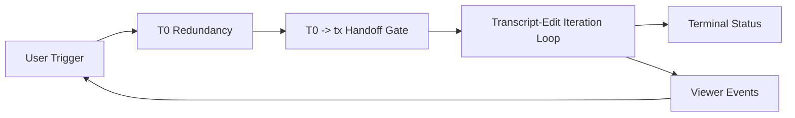
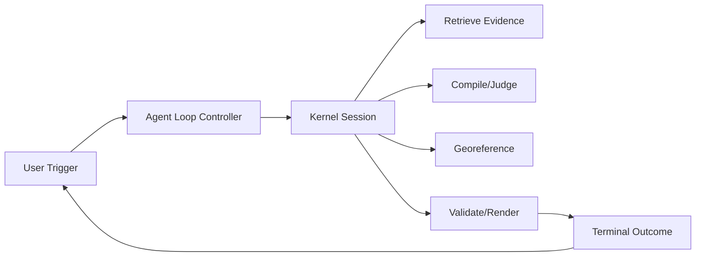

# Agent Ecosystem Architecture (Top-Down)

## Purpose
This document gives a holistic system view of the Plattera agent ecosystem:
- core services
- major loops
- orchestration boundaries
- action/tool execution surfaces
- data and event flows between subsystems

It is written as an architectural map for design and debugging, not as an implementation tutorial.

Related references:
- `docs/agent-kernel-action-tool-menu.md`
- `docs/agent-loop-system-overview.md`
- `docs/transcript-edit-loop-orchestration.md`
- `docs/retrieval_system_spec.md`

---

## 1) System Topology (high-level)

Interpretation:
- UI talks to API.
- API starts/observes orchestrators.
- Orchestrators drive kernel sessions and/or loop logic.
- Kernel executes typed actions via configured tool dependencies.
- Tools consume and produce artifacts.
- Event bus streams progress back to Agent Viewer.

---

## 2) Main Runtime Layers

### 2.1 Presentation layer
- Frontend workspaces
- Agent Viewer timeline/prompt surfaces
- Feedback submission channel

Primary responsibility:
- display events/status/artifacts
- collect human feedback

Not responsible for:
- authoritative loop decisions
- deterministic safety invariants

### 2.2 API/transport layer
- Starts runs
- Returns run snapshots
- Streams SSE events
- Accepts feedback posts

Primary responsibility:
- request/response transport and lifecycle endpoints

### 2.3 Orchestration layer
Two important families:
1. Transcript-oriented orchestration (T0 handoff + tx loop)
2. Feature-graph/mapping oriented orchestration (agent-loop + kernel policy path)

Primary responsibility:
- choose sequence of actions/stages
- enforce iteration boundaries
- apply escalation/terminal policy

### 2.4 Kernel execution layer
- Step-driven session manager
- Action execution
- Budgets, idempotency, refusal contracts
- Dashboard/latest refs/tool menu synthesis

Primary responsibility:
- deterministic step contract execution and bookkeeping

### 2.5 Tool/service layer
- Retrieval tools
- Feature graph tools
- Transcript-edit tools
- Georeference/validate/render tools

Primary responsibility:
- perform concrete work for each action type
- emit artifacts + reason codes

### 2.6 Artifact/data layer
- Dossier artifacts
- Agent-kernel run artifacts
- Retrieval corpus views/chunks
- Mapping outputs/validation results
- Logs (backend + frontend timing)

Primary responsibility:
- durable source of truth for loop continuity and replay.

---

## 3) Core Subsystems and Relationships

### 3.1 Agent Kernel
Key objects:
- `KernelSessionManager`
- `ActionExecutor`
- `ActionType` universe
- step records + idempotency ledger + dashboard

Kernel relation to loops:
- Loops call kernel actions as typed steps.
- Kernel returns structured execution state and artifact refs.

Important architectural rule:
- Action universe can be larger than context wiring.
- Tool menu is dependency-config driven per runtime.

### 3.2 Retrieval System
Conceptual role:
- evidence acquisition substrate (lexical/semantic/provenance lanes)

System role:
- supports `retrieve_evidence` action where wired
- emits retrieval artifacts and evidence payloads

Current transcript-loop relation:
- retrieval exists in platform
- transcript-edit runtime currently does not wire `retrieve_evidence` in its narrow session setup

### 3.3 Transcript Ecosystem (T0 + tx loop)
T0 (image-to-text redundancy):
- generate candidate drafts
- persist draft artifacts
- publish T0 lane events

Transcript-edit loop:
- post-T0 repair/verify/escalate/apply pipeline
- uses tx action family (`tx_*`)
- emits tx lane events and terminal status

Viewer relation:
- T0 and tx are currently represented in shared transcript-edit stream with lane metadata.

### 3.4 Mapping/Feature-Graph Ecosystem
Agent-loop / kernel policy path typically uses:
- `retrieve_evidence`
- `compile`
- `judge`
- `bundle`
- `georeference`
- `validate`
- `render`
- optional patch proposals

These actions drive deterministic quality gates and mapping readiness.

---

## 4) Loop Families (top-down behavior)

### 4.1 Transcription + Transcript-Edit family

Responsibility split:
- T0: candidate generation
- tx: audit/investigate/verify/plan/apply/escalate
- viewer: observability + feedback surface

### 4.2 Agent-loop mapping family

Responsibility split:
- controller: selects next action
- kernel/tools: execute deterministic contracts
- retrieval/mapping services: concrete evidence + mapping outputs

---

## 5) Execution Contexts and Tool Menu Reality
Important design truth:
- "Action exists in platform" != "Action available in this run context"

Why:
- each runtime can construct `KernelSessionManager` with different dependency sets

Example:
- transcript-edit contexts often wire only tx actions
- default kernel context wires broader graph/retrieval/mapping actions

Source of truth:
- `docs/agent-kernel-action-tool-menu.md`

---

## 6) Control Plane vs Decision Plane

### Control plane (program-owned)
- session lifecycle
- step execution contracts
- idempotency/budget enforcement
- artifact persistence
- event streaming

### Decision plane (agent/LLM-owned, depending on loop design)
- semantic interpretation
- conflict adjudication
- evidence weighting
- plan choice/escalation rationale

Why this split matters:
- keeps orchestration deterministic and auditable
- allows decision authority to shift without destabilizing infrastructure

---

## 7) Eventing and Observability Architecture
Event sources:
- orchestrator phase/status payloads
- kernel/tool progress states
- frontend timing telemetry

Transport:
- SSE streams via Agent Viewer endpoints
- in-memory event bus with per-stream history replay

Logs:
- backend session logs (`backend/logs/app_*.log`)
- frontend forwarded logs (`/api/logs/frontend`)

Observability consequence:
- user-perceived immediacy can result from deterministic pre-model phases and/or replay behavior.

---

## 8) Artifact-Centric Continuity
System continuity is artifact-first:
- each major action writes artifacts or inline deterministic outputs
- latest refs aggregate current run state
- loops can hydrate/resume from durable refs

This enables:
- replayability
- auditability
- cross-loop handoffs (transcript -> mapping contexts)

---

## 9) Current Friction Points (architecture-level)
1. Context-specific menu differences are easy to miss without an explicit matrix.
2. Shared transcript stream for T0 + tx can blur phase boundaries in UI perception.
3. Transcript-edit pre-LLM deterministic decisioning can introduce low-value noise if decision authority is intended to be LLM-led.
4. Retrieval exists platform-wide but is not yet first-class in transcript-edit iteration flow.

---

## 10) Strategic Direction Options
Option A: Deterministic-led hybrid (current-ish)
- deterministic early triage + model adjudication later

Option B: LLM-led decisions + deterministic guardrails
- orchestration remains deterministic
- semantic decisioning moves to model-owned stages
- deterministic components enforce safety/apply invariants

Option C: Full unified action policy
- transcript and mapping loops converge toward one policy-driven action graph with per-objective tool menus

---

## 11) Quick Glossary
- Loop orchestrator: sequence controller for a run.
- Kernel session: step-driven action execution context with budgets/idempotency.
- Tool menu: context-specific set of executable actions.
- Action universe: full enum of possible actions.
- Latest refs: compact map of current artifact pointers.
- Closure blocker: unresolved decision item affecting mapping readiness.
