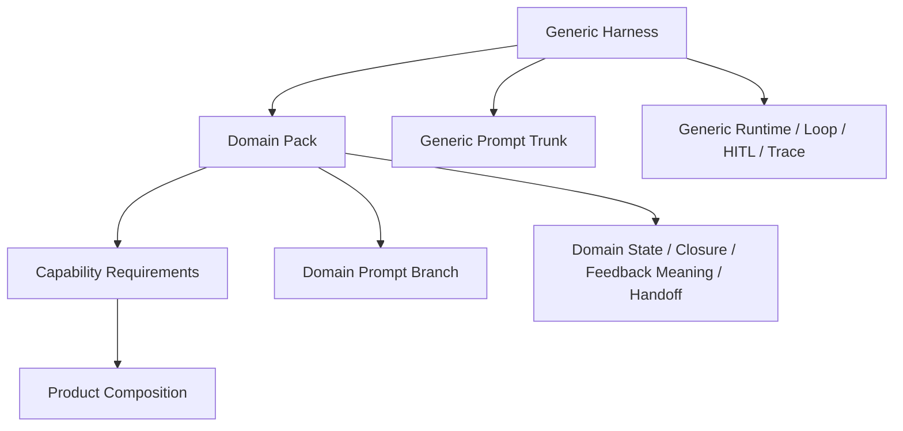

# Domain Pack Architecture

Date: 2026-03-25
Status: Current target architecture
Scope: Domain-pack structure, ownership, and implementation direction

Related:

- `docs/architecture/harness/harness-constitution.md`
- `docs/architecture/harness/domain-pack-constitution.md`
- `docs/architecture/harness/native-harness-core-and-domain-pack-architecture-v1.md`
- `docs/architecture/harness/prompt-system-architecture.md`
- `docs/architecture/harness/prompt-observability.md`

---

## 1. Purpose

This document defines what a domain pack should look like in code and in architecture.

It does not treat any existing domain as the template dictator.

Instead, it starts from the generic harness and asks:

**What is the smallest clean semantic bundle a domain must provide so the harness can host its mission without becoming mission-shaped?**

---

## 2. Core Model

The domain-pack layer sits between:

- the generic harness
- product composition
- concrete mission semantics

The clean split is:

- harness owns machinery
- domain pack owns semantics
- product composition owns concrete tool/provider realization



---

## 3. What A Domain Pack Should Contain

The canonical domain-pack sections are:

1. Domain Manifest
2. Domain Doctrine
3. Domain State Authority
4. Domain Projection / Read Models
5. Focus Context Hydration
6. Execution Translation
7. Domain Closure Semantics
8. Domain Feedback Semantics
9. Capability Requirements
10. Handoff Semantics

These are architecture sections, not necessarily one file each.

The pack adapter class or protocol implementation is only the hosting shell around them.

---

## 4. Canonical Section Definitions

## 4.1 Domain Manifest

Purpose:

- identify the pack
- describe the family it belongs to
- declare its required capabilities
- declare supported handoff targets or postures

Suggested fields:

- `domain_id`
- `family_id`
- `display_name`
- `capability_requirements`
- `supported_handoffs`
- `compatibility_status`

The manifest is not a workflow script.

It is a registration and identity surface.

## 4.2 Domain Doctrine

Purpose:

- describe the world the agent is operating in
- define what matters in that world
- define what evidence means
- define what closure means

Code surfaces likely include:

- domain prompt branch
- domain surface doctrine
- domain examples or schema guidance where needed

This should integrate cleanly with the shared prompt trunk.

## 4.3 Domain State Authority

Purpose:

- hold the domain's own truth surfaces
- preserve the mission's semantic state

Examples:

- domain-native ledger or state graph
- blocker/dependency registry
- domain-local feedback state
- artifact lineage relevant to domain truth

This is not shared-harness truth.

This is the domain's native truth layer.

## 4.4 Domain Projection / Read Models

Purpose:

- adapt domain-native truth into shared generic containers
- expose bounded read models for shared orchestration and reporting

Examples:

- generic active-item projection
- generic blocker projection
- generic closure posture projection
- generic runtime summary projection

The harness may host generic containers.

The domain owns how its native truth maps into them.

## 4.5 Focus Context Hydration

Purpose:

- given an already-chosen focus item, assemble the bounded relevant context for that focus

This may include:

- relevant state row or item
- relevant evidence
- recent attempts
- feedback
- relevant artifacts and refs
- domain-specific supporting summaries

This is not:

- focus discovery
- focus authorship
- deterministic focus choice

It is a context-materialization seam only.

## 4.6 Execution Translation

Purpose:

- translate semantic moves into concrete actions/tools/providers

This is where the pack turns:

- "gather more evidence"
- "apply bounded change"
- "request human feedback"

into execution-ready requests for the shared execution kernel.

This layer must remain:

- explicit
- bounded
- deterministic in realization

It must not become a hidden planner.

## 4.7 Domain Closure Semantics

Purpose:

- define what completion, blockage, risk, ambiguity, and readiness mean in this domain

The harness may host generic terminal rails.

The pack owns domain closure meaning.

## 4.8 Domain Feedback Semantics

Purpose:

- define how human or external feedback affects domain truth

The harness transports feedback.

The pack determines what that feedback means.

## 4.9 Capability Requirements

Purpose:

- declare what classes of resources/actions this domain requires

Examples:

- image evidence
- transcript audit
- retrieval
- patch application
- graph compilation

These are requirements, not implementations.

Product composition maps them to concrete providers and action wiring.

## 4.10 Handoff Semantics

Purpose:

- express downstream readiness or transition posture

Examples:

- ready for downstream domain
- blocked pending dependency
- waiting on human
- closure reached but not promotable

The pack may recommend.

Mission runtime decides actual transition mechanics.

---

## 5. Focus: The Most Important Domain-Pack Seam

This seam must remain explicit.

## 5.1 Focus discovery

What unresolved items exist.

Owner:

- agent-authored or human-authored semantics

## 5.2 Focus selection

Which item is active now.

Owner:

- ideally agent-authored state

Harness role:

- carry continuity
- preserve active focus mechanics

## 5.3 Focus context hydration

What bounded context attaches to an already-chosen focus.

Owner:

- domain pack

## 5.4 Focus move resolution

What to do next about that focus.

Owner:

- agent-authored reasoning

Implementation rule:

If a design makes these four concerns hard to distinguish, the design is too blurry.

---

## 6. Recommended Code Shape

The canonical code shape should be a thin adapter shell over a small domain bundle.

Conceptual template:

```text
backend/agents/<domain>/
  manifest.py
  prompt_sources.py
  domain_pack.py
  state.py
  read_models.py
  projection.py
  focus_hydration.py
  execution_translation.py
  closure.py
  feedback.py
  capabilities.py
  handoff.py
```

Not every pack must use exactly these filenames.

But every mature pack should have these responsibilities somewhere.

---

## 7. Shared Contracts To Introduce

The shared infrastructure should stay minimal.

Recommended shared concepts:

### 7.1 Domain manifest contract

Shared model describing:

- identity
- family
- capability requirements
- handoff support

### 7.2 Capability requirement contract

Shared model describing:

- capability id
- required vs optional
- maybe capability role/category

### 7.3 Handoff posture contract

Shared model describing:

- no handoff
- recommended handoff
- blocked pending dependency
- waiting on human
- ready for downstream domain

These should be shared contracts.

They should not become a giant framework.

---

## 8. Relationship To The Existing 9-Hook Protocol

The current `DomainPack` protocol in the orchestration kernel remains the hosting seam.

But it should be interpreted as a mechanical host grammar, not the whole mental model.

Useful grouping:

- `orient + refresh` = state initialization / reconciliation
- `project` = domain projection
- `build_focus_packet` = focus-context hydration
- `resolve_move` = agent-authored semantic move resolution
- `compile_move` = execution translation
- `supply_progress_metrics + supply_closure_rules + integrate_feedback` = convergence semantics

This grouping is the better design vocabulary.

---

## 9. Capability Model

Tool menus should not be treated as the deepest identity of a domain.

Domains should declare capability requirements.

Product composition should realize them as:

- concrete action types
- providers
- service registrations
- session-level tool menus

This allows:

- overlap across domains
- family-level reuse
- future domains with very different tool ecosystems

without forcing one fake universal menu.

---

## 10. Handoff / Family Model

For future multi-domain flows, prefer:

- family
- pack
- explicit handoff posture

over:

- giant blended mega-domain
- hidden cross-pack control flow

Example family:

- `mapping`

Example packs:

- `transcript_edit`
- `deed_to_ir`

The pack expresses handoff readiness.

The runtime decides actual transitions.

---

## 11. Anti-Patterns

Reject designs where:

- the pack becomes a second runtime
- the pack determines semantic focus truth through deterministic helpers
- the pack scripts a fixed sequence of work
- capability declarations become hidden plan logic
- execution translation becomes a semantic planner
- product/provider wiring becomes confused with domain meaning

---

## 12. Implementation Direction

Recommended order:

1. freeze doctrine and ownership rules
2. add minimal shared manifest / capability / handoff contracts
3. make pack construction explicit around those shared concepts
4. audit transcript-edit against the target
5. refactor transcript-edit into the canonical pack shape
6. expand to other domains after the first exemplar is stable

---

## 13. Summary

The domain pack should be:

- a semantic specialization bundle
- a bounded translator between domain meaning and generic rails
- explicit in doctrine, state, hydration, execution translation, closure, feedback, and handoff

It should not be:

- a workflow script
- a second runtime
- a hidden planner
- a bag of unrelated helpers wrapped in a 9-hook class

The generic harness remains the machine.

The domain pack gives that machine a domain-specific world to operate in.
