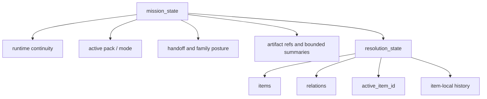

# Mission State And Resolution State Architecture

Date: 2026-03-26
Status: Target architecture and migration anchor
Scope: Shared harness continuity, organized work, active-item continuity, and authorship boundaries

Related:

- `docs/architecture/harness/harness-constitution.md`
- `docs/architecture/harness/domain-pack-architecture.md`
- `docs/architecture/harness/generic-work-board.md`
- `docs/architecture/harness/minimal-shared-run-state-envelope.md`

---

## 1. Purpose

This document defines the intended replacement vocabulary and shape for the harness's generic organized-work surfaces.

The target is:

- `mission_state` as the top-level generic continuity object
- `resolution_state` as the generic active problem/work surface inside it

This is a naming cleanup and a semantic cleanup.

It exists to prevent three kinds of drift:

- treating a historical `work_board` wire name as architecture truth
- treating `decision_ledger` as if the surface must be a flat sequential list
- allowing deterministic focus ranking to become the practical source of what matters next

---

## 2. Core Model

The harness should converge on this generic model:

The important distinction is:

- `mission_state` is harness continuity
- `resolution_state` is organized work

The harness carries both.
The agent authors the semantic meaning within them.

---

## 3. Why This Replaces Work Board / Decision Ledger Language

`work_board` is a historical wire/module name.

It is not the right architecture metaphor because it suggests:

- a project-management board
- a fixed card list
- a narrow linear workflow metaphor

`decision_ledger` is better than `work_board`, but it still suggests:

- a flat sequential ledger
- a record-first metaphor rather than an active work-state metaphor

The intended system is broader than either metaphor.

The generic work surface must be able to represent:

- linear work
- revisited work
- parallel work
- dependency-shaped work
- contradiction-driven work
- reopening of previously closed items

That is why `mission_state` / `resolution_state` is the better naming target.

---

## 4. Mission State

`mission_state` is the harness-owned continuity object for the current run or mission.

It should remain generic and mechanical.

It may carry:

- mission identity
- active pack / active mode
- run continuity and resumability posture
- bounded blocker / waiting / verification summaries
- terminal posture
- handoff posture refs
- family coordination refs
- trace refs
- high-signal artifact refs
- timestamps and ordering anchors
- `resolution_state`

It must not become:

- a domain ontology sink
- a second domain truth store
- a place where shared runtime code writes semantic conclusions on the agent's behalf

---

## 5. Resolution State

`resolution_state` is the generic active problem/work surface inside `mission_state`.

It is not a board, queue, checklist, or ledger by requirement.

It is a revisable organized-work surface that the agent can use to describe, track, and evolve the smaller tasks that make up the mission.

It should be capable of holding:

- items
- lightweight relations between items
- evidence refs
- dependencies
- completion conditions
- generic notes
- opaque domain payload
- active-item continuity
- item-local history

It should be graph-capable without requiring a graph engine as the starting point.

---

## 6. Resolution State Items

Each item should be treated as a revisable work claim, not sacred truth.

An item is the generic representation of something like:

- a question to resolve
- a contradiction to narrow
- a missing dependency
- a bounded artifact change to complete
- a verification concern
- a domain-specific subtask

Recommended generic item fields:

- `item_id`
- `title`
- `status`
- `kind`
- `summary`
- `dependencies`
- `evidence_refs`
- `completion_condition`
- `notes`
- `domain_payload`

Optional but strongly useful fields:

- `materiality`
- `scope`
- `history`
- `provenance`
- `last_updated_at`

The exact contract can stay bounded and additive.
The important rule is that the shared fields remain generic.

---

## 7. Item Status Semantics

Statuses should be treated as revisable claims.

Recommended generic statuses:

- `open`
- `active`
- `blocked`
- `waiting_human`
- `waiting_evidence`
- `resolved`
- `superseded`

Optional additional generic statuses may exist if they remain broadly reusable.

Critical rule:

- `resolved` is a current best claim, not immutable truth

An agent or later iteration must be able to:

- reopen an item
- split an item
- merge an item
- supersede an item
- revise previous closure claims

That is normal behavior, not an exception case.

---

## 8. Relations

The first version should support lightweight relations only.

Good starter relation kinds:

- `depends_on`
- `supports`
- `contradicts`
- `subtask_of`
- `supersedes`

These are enough to make the system graph-capable without overbuilding a graph subsystem.

The shared harness should not require every domain to become graph-native on day one.

---

## 9. Active-Item Continuity

The primary deterministic coherence mechanic should be `active_item_id`.

That means:

- the runtime may preserve which item was active last
- the next iteration may be shown that active item and its recent history
- if the item is still open, the agent may naturally continue it

This is a continuity rail.
It is not a semantic chooser.

The runtime may carry:

- `active_item_id`
- bounded recent attempts for that item
- the latest item-local history summary

The runtime must not:

- deterministically rank all open items and choose the semantic winner
- convert advisory ordering into practical focus truth

The agent still decides whether to:

- continue the active item
- resolve it
- reopen it
- split it
- move to another item

---

## 10. Item-Local History

Each item should be able to carry bounded recent history so the next iteration can understand continuity without scanning the whole mission.

Useful item-local history may include:

- last attempted move
- outcome of that move
- evidence gathered
- reason the item remains open
- reason the item was reopened
- recent human feedback relevant to that item

This history is supportive context.

It should not become:

- a hidden planner
- deterministic next-step instruction
- a substitute for the agent's own current reasoning

---

## 11. Orientation Responsibility

Orientation should become more explicitly responsible for helping establish the early `resolution_state`.

That means orientation may help produce:

- initial work items
- initial dependencies
- initial contradictions
- initial evidence refs
- initial active-item posture

But the constitutional rule still applies:

- orientation may provide generic containers
- the agent authors the semantic content

Orientation is not an excuse to resurrect deterministic checklist truth.

---

## 12. Deterministic Code: Allowed vs Forbidden

Allowed deterministic behavior:

- persist `mission_state`
- persist `resolution_state`
- validate shared structure
- carry `active_item_id`
- carry recent item-local history
- expose relations and evidence refs
- normalize shape
- preserve reopen / supersede transitions mechanically

Forbidden deterministic behavior:

- create practical work items from hard-coded semantic logic as the real source of work truth
- rank candidate items and thereby choose what matters next
- decide which item must be active from scripted priority ladders
- declare semantic completion because of deterministic category logic
- inject working plans or tactic hints as if they were just neutral state

The harness may preserve continuity.
It may not author semantic direction.

---

## 13. Domain Pack Relationship

Domain packs should map native domain truth into `resolution_state`.

That means:

- domains may still keep native write/persistence seams where needed
- shared runtime read truth should converge on `mission_state` / `resolution_state`
- domains may enrich items through `domain_payload`
- domains may project native blockers, dependencies, or evidence into generic item/relation surfaces

The shared state model should not erase domain richness.

But domains should stop inventing parallel organized-work metaphors once the shared state model is sufficient.

---

## 14. Transcript-Edit Implication

Transcript-edit is the first domain where this cleanup matters immediately.

The target shape is:

- keep transcript-edit native write seams only where still genuinely useful
- make shared read truth converge on `resolution_state`
- remove deterministic advisory focus ranking as practical focus authority
- simplify focus hydration into evidence, context, history, and active-item continuity

Transcript-edit should not keep a second de facto focus-authority system on top of the shared organized-work surface.

---

## 15. Compatibility During Migration

Migration may temporarily preserve:

- `work_board.v1` as a wire/schema id
- `decision_ledger` package names as compatibility surfaces

But these must be treated as compatibility layers only.

New architecture should be described in terms of:

- `mission_state`
- `resolution_state`

The current canonical shared contract lives in `backend/harness/mission_state/contracts.py`.
The older `harness.work_board` and `harness.decision_ledger` modules remain secondary
projection/compatibility surfaces until downstream consumers finish migrating.

Compatibility naming must not remain the teaching surface for future work.

---

## 16. Summary

The target system is:

- `mission_state` for top-level continuity
- `resolution_state` for revisable organized work
- graph-capable, not graph-obsessed
- agent-authored in semantic motion
- deterministic only in persistence, structure, and continuity transport

The key deterministic rail should be active-item continuity, not ranked focus authority.

That is the architecture direction the harness should now converge on.
