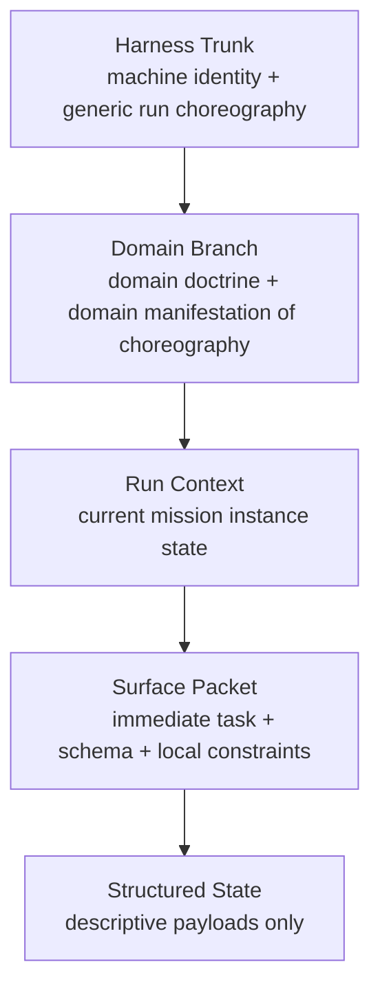

# Prompt System Architecture

This document defines the target architecture for prompt layering in the Plattera harness.

Its purpose is to make prompt behavior:

- constitutionally clean
- layered by ownership
- easy for humans to inspect
- easy for the runtime to compose
- resistant to stacked steering and hidden semantic authorship

The core principle is:

**Prompt layering must be composable for the machine and legible for the human.**

---

## 1. Core Design Law

Prompt architecture is organized by **ownership** and **granularity**.

Each layer gets to say a different kind of thing.

Only one layer should speak at each level of granularity.

That means:

- harness trunk speaks in machine law
- domain branch speaks in domain doctrine
- run context speaks in current mission state
- surface packet speaks in immediate task/schema
- structured state speaks in observations/history only

If two layers start speaking at the same level, the system drifts into stacked steering.

---

## 2. Target Stack

This is the intended semantic layering of every substantive model call.

The final runtime payload may be composed dynamically, but these ownership layers must remain distinct.

---

## 3. Layer Definitions

## 3.1 Harness Trunk

**Owner**

- shared harness only

**Role**

- always-on machine identity and universal run law

**Contains**

- what kind of machine the model is inside
- that the run is bounded and multi-turn
- that conversational memory is not the continuity substrate
- what the harness owns vs what the model owns
- generic run choreography
- generic response law
- generic warning / HITL / anti-spin posture

**May contain generic orchestration law**

Examples:

- early work should establish reality before forcing closure
- later work should build cumulatively on established findings
- warnings and pending feedback must be addressed explicitly
- repeated no-delta conditions require pivot, escalation, or justification

**Must not contain generic tactics**

Forbidden examples:

- spend N iterations orienting
- inspect artifacts in a specific order
- review class X before class Y
- use tool A before tool B

Those are no longer generic machine law. They belong in lower layers or not in deterministic prompting at all.

**Must not contain**

- domain ontology
- domain evidence doctrine
- domain closure doctrine
- run-local facts
- immediate task instructions

The harness trunk may be thorough.
It does not need to be minimal.
It does need to stay generic.

---

## 3.2 Domain Branch

**Owner**

- domain pack / domain layer

**Role**

- semantic doctrine for one mission family

**Contains**

- what kind of world this domain is
- what counts as evidence here
- what closure means here
- what risks matter here
- how generic run choreography typically manifests here

This is where domain-specific mirroring belongs.

Example:

- harness trunk: establish reality early
- domain branch: in transcript edit, this usually means reviewing drafts, source images, and mapping-relevant verification targets

That is correct mirroring because the abstraction levels are different.

**Must not contain**

- overrides of harness law
- current run-specific facts
- immediate output schema
- hidden deterministic prioritization masquerading as doctrine

**Lower-layer rule**

Domain branch may specialize trunk law for its world.
It must not rewrite trunk law.
It should also avoid redundantly restating trunk doctrine unless needed to localize it for the domain.

---

## 3.3 Run Context

**Owner**

- runtime / orchestration composition

**Role**

- current mission-instance state

**Contains**

- mission objective
- run identity
- active posture
- warnings
- HITL state
- artifact refs
- bounded current work state
- resumability / transition state
- bounded recent outcomes

**Must not contain**

- generic harness law
- domain doctrine
- immediate task schema
- hidden strategy

Run Context is mostly **state**, not doctrine.

---

## 3.4 Surface Packet

**Owner**

- the specific model-call surface

**Role**

- define what this one call must do

**Contains**

- exact task framing
- required output schema
- allowed response forms
- immediate constraints

**Must not contain**

- re-teaching the harness trunk
- re-teaching the domain branch
- long-run strategy
- compensatory doctrine that belongs in higher layers

Surface Packet is the narrowest prose layer.

---

## 3.5 Structured State

**Owner**

- produced by shared or domain systems, but not a doctrine owner

**Role**

- machine-readable supporting payloads

Examples:

- `run_progress_frame`
- `support_state`
- artifacts / refs
- `rationale_continuity_strip`

**Contains**

- observations
- counters
- state snapshots
- bounded history
- evidence links
- continuity carriers

**Must not contain**

- imperative strategy
- deterministic next-step authorship
- hidden planner logic
- semantic truth claims that should remain agent-authored

Structured State is **not** another doctrine layer.
It informs the model.
It must not compete with trunk/branch/packet prose.

---

## 4. Prose Doctrine vs State Payload

The system must explicitly distinguish between:

### Prose doctrine layers

- harness trunk
- domain branch
- surface packet

These teach law, doctrine, norms, and local task framing.

### State payload layers

- run context
- structured state

These carry facts, observations, continuity, warnings, and payload state.

This distinction is necessary because otherwise state payloads tend to accumulate hidden prompt doctrine over time.

---

## 5. Prompt Source of Truth vs Prompt Assembly

These are separate concerns and must remain separate in implementation.

## 5.1 Prompt Source of Truth

This is where the actual authored words live.

Requirements:

- canonical
- human-readable
- organized by ownership layer
- easy to inspect directly

A developer should be able to answer:

- what are the exact harness words?
- what are the exact domain words?
- what are the exact surface words?

without reconstructing them from runtime helpers.

## 5.2 Prompt Assembly

This is how the runtime assembles final prompts.

Requirements:

- deterministic
- explicit
- thin
- mostly assembly, not authorship

Ownership rule:

- the harness owns the final cross-layer assembly
- the domain owns its branch blocks and any thin domain-local prompt shaping
- surface code owns immediate task framing

There should be one final stitch owner.
That owner should be the harness-side composer, not the domain pack.

Default composition order:

1. harness trunk
2. domain branch
3. surface packet
4. run context
5. structured state

The composer should not be the main home of the English wording.

---

## 6. Human Review Ergonomics

Human inspectability is a first-class design requirement.

Prompt architecture should not be allowed to become:

- scattered across many helpers
- hidden behind assembly logic
- reconstructable only by mentally tracing code paths

Every major prompt layer should have a canonical human-readable source surface.

That means the repo should converge toward:

- one obvious place for shared harness prompt text
- one obvious `prompting/` folder per domain for domain doctrine text
- one obvious place per surface for local task/schema text

Runtime composition may quilt these together, but the authored words themselves should remain easy to inspect.

---

## 7. Source Layout Direction

This document does not hard-code final filenames, but the target architecture should look like:

### Shared harness prompt source

One canonical module/file containing:

- machine identity block
- generic run choreography block
- generic response law block

### Domain prompt source

One canonical `prompting/` folder per domain containing:

- `branch.py` as the default initial source surface
- optional extra files only when the prompt surface actually grows enough to justify them

Containing:

- domain doctrine block
- domain manifestation-of-choreography block
- domain evidence / closure / risk guidance

### Surface prompt source

Surface-local modules containing:

- task framing
- schema constraints
- response-shape rules

### Composer

A thinner harness-owned assembly layer that:

- chooses blocks
- assembles them in order
- attaches run context and structured state
- performs the final cross-layer stitch

---

## 8. Repo Reality Today

Current repo state already contains partial pieces of this design:

### Existing shared prompt source concept

- [backend/agents/common/identity_composer.py](/C:/projects/Plattera/backend/agents/common/identity_composer.py)

The repo still has transitional shared prompt-source surfaces under `backend/agents/common/`.
The architectural target is:

- explicit shared harness trunk source modules
- a harness-owned final composer
- no reliance on `prompt_sources.py` as a naming standard

### Existing domain/surface prompt source

- transcript-edit domain prompt surfaces are in transition and should converge toward:
  - `backend/domains/<family>/<domain>/prompting/branch.py`
  - optional additional files under that `prompting/` folder only when earned

The naming target is `prompting/`, not `prompt_sources.py`.

### Existing structured state payloads

- [backend/harness/orchestration_kernel/run_progress_frame.py](/C:/projects/Plattera/backend/harness/orchestration_kernel/run_progress_frame.py)
- [backend/harness/tracing/rationale_continuity_strip.py](/C:/projects/Plattera/backend/harness/tracing/rationale_continuity_strip.py)

---

## 9. Current Impurities / Watchpoints

### 9.1 Mixed ownership in shared common

[backend/agents/common/identity_composer.py](/C:/projects/Plattera/backend/agents/common/identity_composer.py) currently mixes:

- shared assembly
- a deed-to-IR compatibility branch
- shared surface taxonomy

The shared trunk source and transcript-edit branch source have now moved into
dedicated modules. The remaining deed branch is compatibility residue, not the
clean end state.

### 9.2 Surface doctrine sprawl

[backend/agents/transcript_edit/prompting.py](/C:/projects/Plattera/backend/agents/transcript_edit/prompting.py) still carries surface-local doctrine and packet/task assembly.

This is now more clearly assembly than source ownership, but some prompt text
still lives here until later surface cleanup.

### 9.3 Structured-state advisory drift

[backend/harness/tracing/rationale_continuity_strip.py](/C:/projects/Plattera/backend/harness/tracing/rationale_continuity_strip.py) includes `carry_forward_hint`.

That field is one of the clearest risk seams where continuity payload can drift into tactical authorship.

This should be treated as a live watchpoint during implementation.

---

## 10. Hard Rules

### 10.1 One-layer-one-granularity

Only one layer should speak at each level of abstraction.

### 10.2 Lower layers may narrow, not rewrite

Lower layers may instantiate higher-layer law for their scope.
They must not override it.

### 10.3 Lower layers should not redundantly repeat higher-layer doctrine

Lower layers may localize higher-layer doctrine when needed.
They should not restate it verbatim or near-verbatim without a real localizing purpose.

This avoids prompt bloat and stacked steering even when no explicit contradiction exists.

### 10.4 Structured state must remain descriptive

If a payload field starts to read like advice, tactic, or planner logic, it should be scrutinized as possible semantic overreach.

### 10.5 Source text must remain inspectable

Every major prompt layer must have a canonical human-readable source surface.

---

## 11. Target Outcome

The prompt system should converge to:

- one true shared harness trunk
- one domain branch per domain
- one run-context layer carrying state
- one surface packet layer carrying immediate task framing
- structured state that remains descriptive only
- clear source-of-truth files for each ownership layer
- thin prompt composition logic

That is the target architecture this repo should implement.

---

## 12. Current Repo Mapping

Current implementation surfaces should be read as:

| Layer | Current code surface |
| --- | --- |
| Shared harness prompt source | shared harness trunk source modules |
| Shared harness prompt assembly | harness-owned composer surfaces |
| Domain branch source | `backend/domains/<family>/<domain>/prompting/branch.py` |
| Domain-local prompt helpers | additional files under `backend/domains/<family>/<domain>/prompting/` only when earned |
| Prompt observability scaffold | [backend/agents/common/prompt_observability.py](/C:/projects/Plattera/backend/agents/common/prompt_observability.py) |
| Run context / structured state | [backend/harness/orchestration_kernel/run_progress_frame.py](/C:/projects/Plattera/backend/harness/orchestration_kernel/run_progress_frame.py), [backend/harness/tracing/rationale_continuity_strip.py](/C:/projects/Plattera/backend/harness/tracing/rationale_continuity_strip.py) |

The shared trunk source is intentionally canonical. Domain doctrine should live
in domain-owned `prompting/` folders. Prompt assembly should stay thinner than source
ownership, and the final cross-layer stitch should stay harness-owned.
