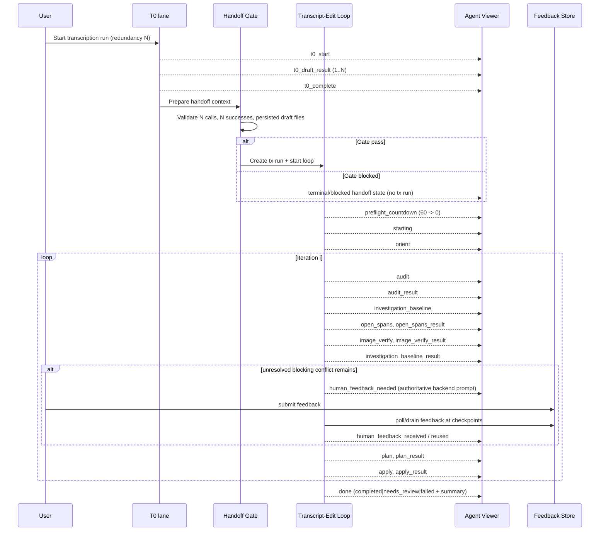
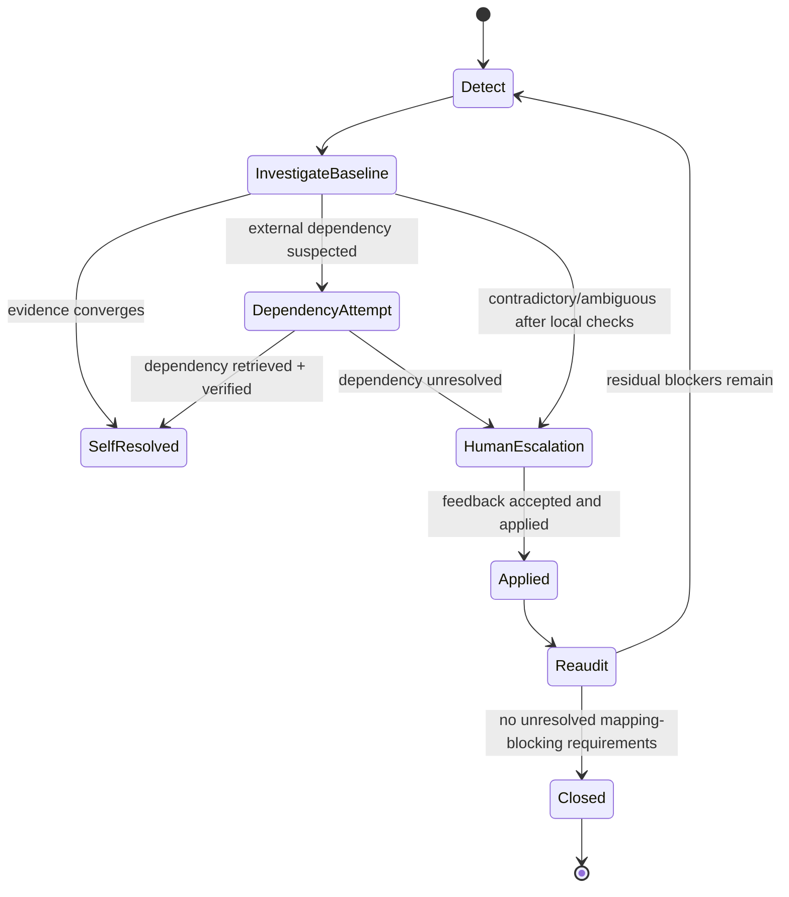
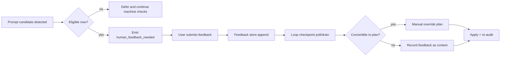

# Transcript Edit Loop Orchestration (External Reference)

## 1) Purpose
This document describes the full transcript-edit orchestration pipeline in plain language for readers without repository access.

It covers:
- Mission and closure model
- Runtime architecture (T0 lane, tx lane, viewer stream)
- Exact phase order and escalation logic
- Prompt templates and tool/action surfaces
- Data contracts and payload schemas
- Observability and timing markers
- Known UX/perception edge cases

This is intended as an operational spec, not marketing prose.

---

## 2) What the loop is trying to do
Primary objective:
- Produce a transcript that is as close as possible to zero mapping-critical inaccuracies before downstream mapping.

Operational objective:
- Attempt autonomous reconciliation first.
- Escalate to human only when unresolved, blocking ambiguity remains after evidence attempts.
- Return explicit terminal state with reason and closure requirements.

Closure model:
- Layer 1: canonical recovery (does transcript match source deed content)
- Layer 2: canonical sanity (if recovered, does deed content remain internally coherent)
- Layer 3: dependency completeness (do we have enough external dependencies for mapping)

Terminal closure state:
- `achieved` if layers are satisfied
- `blocked` otherwise

---

## 3) Runtime lanes and ownership
There are two primary runtime lanes for this flow:

1. `t0` lane
- Runs initial image-to-text redundancy extraction.
- Emits draft progress and completion lane events.

2. `tx` lane
- Runs transcript edit loop.
- Audits, investigates, verifies, plans, applies, and terminalizes.

Viewer stream model:
- Both lanes publish into one transcript-edit viewer session stream.
- Events are tagged with lane metadata (`lane`, `lane_seq`) and phase.

---

## 4) Core components and responsibilities
T0 orchestration:
- `backend/pipelines/image_to_text/pipeline.py`
- `backend/pipelines/image_to_text/redundancy.py`

Transcript edit controller:
- `backend/agents/transcript_edit/controller.py`

Per-iteration orchestration:
- `backend/agents/transcript_edit/iteration_pipeline.py`

Decision ledger and closure requirements:
- `backend/agents/transcript_edit/decision_ledger.py`

Terminal status/summary:
- `backend/agents/transcript_edit/result_policy.py`
- `backend/agents/transcript_edit/terminalization.py`

Viewer payload contract:
- `backend/agents/transcript_edit/run_reporting.py`

HITL prompt building and feedback polling:
- `backend/agents/transcript_edit/hitl_feedback.py`

Kernel tool implementations:
- `backend/agent_kernel/tooling.py`
- `backend/agent_kernel/actions.py`

---

## 5) End-to-end sequence


---

## 6) T0 stage details
T0 uses redundancy (`N` calls, default common use: 3).

Per draft behavior:
- Calls image model in parallel threads (staggered dispatch + jitter).
- Emits timing marker: `t0_draft_returned draft=x/N success=...`.
- Optional progressive save callback persists each draft.

Redundancy output metadata includes:
- `total_calls`
- `successful_calls`
- `valid_extractions`
- `best_result_index`
- `individual_results[]` (text + status)

Candidate draft extraction for tx:
- Candidate texts are extracted from redundancy individual results.
- Candidate dedup was removed so all valid draft signals are preserved.
- Candidate count capped by request contract max (10).

---

## 7) T0 -> tx handoff gate (hard boundary)
Before tx starts, gate requires:
- `total_calls >= expected_count`
- `successful_calls >= expected_count`
- all persisted raw draft files exist: `transcription_id_v1.json ... transcription_id_vN.json`

If gate fails:
- tx loop is not started
- warning is logged with gate reason

Boundary log marker:
- `TX_LOOP_BOUNDARY ► T0_HANDOFF_GATE expected=... total_calls=... successful_calls=... drafts_persisted=... status=pass|blocked`

---

## 8) Transcript-edit run request contract
Run request model (abbreviated):
- `dossier_id`
- `transcription_id`
- `source_transcript_ref` or `source_text`
- `source_image_refs[]` (max 5)
- `model` (default `gpt-5.2`)
- `max_iterations` (default 4)
- `min_iterations_before_complete` (default 3)
- `mode` (`audit_then_repair_then_promote` by default)
- `auto_promote` (default true)
- `edit_plan` optional
- `candidate_texts[]` (max 10)
- `hitl_enabled` (default true)
- `hitl_wait_timeout_seconds`
- `hitl_poll_interval_seconds`

---

## 9) Controller boot and preflight
Controller starts kernel session with budgets:
- `max_steps = max(8, max_iterations * 4)`
- `max_wall_time_seconds = 600`
- `max_retrieval_calls = 100`
- `max_semantic_calls = 100`
- `max_patch_calls = 100`

Startup sequence:
1. `preflight_countdown` (runtime currently set to 60s in API/pipeline entrypoints)
2. `starting`
3. `orient`
4. enter iteration loop

Preflight log markers:
- `TX_LOOP_PRESTART_COUNTDOWN ► state=starting remaining_seconds=60`
- `TX_LOOP_PRESTART_COUNTDOWN ► remaining_seconds=<n>`
- `TX_LOOP_PRESTART_COUNTDOWN ► state=completed`

---

## 10) Iteration flow (repair path)
Repair path (high-level order):
1. `audit`
2. `audit_result`
3. update decision ledger from findings + disagreements
4. `investigation_baseline` (conflict map shown)
5. `open_spans`
6. `open_spans_result`
7. `image_verify`
8. `image_verify_result`
9. ledger update from image evidence
10. `investigation_baseline_result` (residual blockers + next action)
11. if still unresolved and blocking, emit HITL prompt
12. `plan` -> `plan_result`
13. `apply` -> `apply_result`
14. next iteration re-audit

Design rule now in place:
- First HITL prompt is emitted only after baseline investigation result in that iteration.

---

## 11) Iteration flow (clean path)
If audit is clean enough to branch:
- evaluate policy facts
- optionally run final image sanity verify before terminal/promotion
- optionally run stabilization pass until `min_iterations_before_complete`
- optionally save span seeds
- optionally promote transcript for mapping if policy allows
- otherwise terminalize as clean-no-promote or needs-review

Promotion is blocked if any of:
- non-normalization edits applied
- review-required edits applied
- unresolved actionable blocking closure remains
- error findings remain

---

## 12) Decision ledger model
Decision keys:
- `township` (blocking)
- `range` (blocking)
- `section` (blocking)
- `tie_distance` (blocking)
- `tie_bearing` (blocking)
- `acreage` (non-blocking by default)
- `closure_or_pob` (blocking)

Per-item state includes:
- `state` (`unknown|candidate_found|verified|disputed|accepted_with_risk`)
- `selected_value`
- `alternatives`
- `blocking`
- `evidence_refs`
- `closure_requirement` (when unresolved/required)

Closure requirement fields:
- `block_reason` (`ambiguity|contradiction|dependency`)
- `mapping_blocking` (bool)
- `operational_impact` (`mapping_blocking|transcript_quality_only`)
- `required_information`
- `self_retrievable` (`yes|conditional`)
- `retrieval_attempted`
- `retrieval_blocker`
- `minimal_user_action`
- `resolution_options`
- `evidence_refs`
- `attempt_summary`

---

## 13) Investigation baseline outputs
`investigation_baseline` payload:
- conflict count
- conflict map (decision key + conflicting values)

`investigation_baseline_result` payload:
- evidence attempts made (`open_spans`, `image_verify`)
- residual blockers
- mapping-blocking count
- optional count
- next recommended action
- decision ledger snapshot

---

## 14) Backend HITL prompting (authoritative path)
Prompt builder currently focuses on range conflict:
- requires disagreement hints with multiple range values
- builds options like `Range 74 West`, `Range 75 West`
- prompt id format: `hitl_range_<iteration>_<suffix>`

Exact prompt text:
- `line1`: `Confirm range token for this deed`
- `line2`: `Image/text checks disagree on range values; promotion is blocked pending your choice.`

Feedback handling:
- feedback posted to feedback store by viewer endpoint
- loop polls feedback at checkpoints:
  - `iteration_start`
  - `open_spans`
  - `image_verify`
  - `post_feedback_image_verify`
- feedback can become a manual override edit plan

---

## 15) Planner prompting (exact templates)
Planner system message:
```
You are a legal transcript edit planner. Your mission is to drive the transcript toward zero mapping-critical inaccuracies for downstream deed-to-IR and mapping loops. Propose a bounded EditPlanV0 JSON object only. Faithfully represent source deed semantics, prioritize sanity, and avoid speculative edits. Never treat unresolved bearing/range/tie-distance conflicts as done; plans must explicitly target unresolved conflicts when evidence supports a safe edit. Do not propose purely cosmetic formatting edits (spacing, punctuation, symbol variants) unless meaning changes. Prefer localized normalization edits first. If a finding indicates numeric/PLSS inconsistency and context provides a clear dominant value, you may propose a localized semantic correction with review_required=true. Each op must include drift-safe expected_old.old_excerpt from verbatim transcript text. Prefer anchors locator; use offsets only when anchors are unreliable. Do not produce cross-section edits unless strictly necessary. If findings do not justify changes, return an empty ops list with rationale.
```

Planner user message:
- JSON payload containing:
  - task + constraints
  - schema snippet for `edit_plan_v0`
  - `findings_summary`
  - `top_findings`
  - `span_context`
  - `image_verification`
  - `candidate_disagreement_hints`
  - `mapping_priority_focus`

Planner repair message:
- sent when invalid/empty response
- includes error reason, previous output excerpt, minimal valid example

---

## 16) Image verification prompting (exact task schema)
Each check uses vision prompt payload:
- task: verify transcript claim against deed image
- instructions:
  - return JSON only
  - read relevant image text carefully
  - if uncertain, `status='unclear'`
- output schema:
  - `check_id`
  - `status`: `match|mismatch|unclear`
  - `observed_text`
  - `confidence`: `low|medium|high`
  - `reason`
- check block:
  - `check_id`, `query`, `expected_text`

Image checks support:
- optional crop box
- zoom factor
- high detail vision calls

---

## 17) Kernel tool/action surface available to tx loop
Action types used:
- `TX_AUDIT_TRANSCRIPT`
- `TX_OPEN_TRANSCRIPT_SPANS`
- `TX_VERIFY_TRANSCRIPT_WITH_IMAGE`
- `TX_APPLY_EDIT_PLAN`
- `TX_SAVE_TRANSCRIPT_SPAN_SEEDS`
- `TX_PROMOTE_TRANSCRIPT_FOR_MAPPING`

Required fields (contracts summary):
- `TX_AUDIT_TRANSCRIPT`: `source_transcript_ref | source_text`
- `TX_OPEN_TRANSCRIPT_SPANS`: `source_transcript_ref | source_text`, plus `spans[] OR anchors[]`
- `TX_VERIFY_TRANSCRIPT_WITH_IMAGE`: source transcript + checks payload
- `TX_APPLY_EDIT_PLAN`: `edit_plan`
- `TX_SAVE_TRANSCRIPT_SPAN_SEEDS`: source transcript ref/hash
- `TX_PROMOTE_TRANSCRIPT_FOR_MAPPING`: transcript ref

Tool implementations perform:
- deterministic audit validators
- bounded span extraction
- image verification with summarized result artifacts
- plan apply with refusal-safe report
- span-seed persistence
- mapping pointer promotion

---

## 18) Viewer event envelope and stream behavior
Event envelope fields:
- `protocol`
- `run_id`
- `loop_kind`
- `seq`
- `iteration`
- `timestamp_epoch_seconds`
- `event_type`
- `status` (`stage`, `line1`, `line2`)
- `artifact_refs`
- `payload`

Event bus behavior:
- per-stream in-memory history replay (maxlen 300)
- SSE subscribers receive history then live events
- timing markers log subscribe/publish/delivery

---

## 19) Current phase catalog (tx lane)
Common phases:
- `preflight_countdown`
- `starting`
- `orient`
- `audit`
- `audit_result`
- `investigation_baseline`
- `open_spans`
- `open_spans_result`
- `image_verify`
- `image_verify_result`
- `investigation_baseline_result`
- `human_feedback_needed`
- `human_feedback_received`
- `human_feedback_reused`
- `plan`
- `plan_result`
- `apply`
- `apply_result`
- `stabilize`
- `promote`
- `final_verify_retry`

Terminal event:
- `event_type=done` with status in payload (`completed|needs_review|failed`)

---

## 20) Known UX/perception caveat: synthetic frontend prompts
The frontend currently includes a fallback "synthetic closure prompt" mechanism (`closure_req_*`) that can derive prompts from unresolved ledger state even before backend emits authoritative `human_feedback_needed`.

Impact:
- perceived "instant prompt" after countdown can occur even when backend prompt is delayed until post-investigation.

Mitigation recently added:
- synthetic prompts are gated to require `investigation_baseline_result` first.

Architectural recommendation:
- backend prompts should be authoritative for active HITL.
- synthetic path should be passive guidance (or removed) if strict discipline is required.

---

## 21) Timing and observability markers
Common markers:
- `AGENT_VIEWER_TIMING ► t0_draft_returned`
- `AGENT_VIEWER_TIMING ► t0_handoff_start`
- `AGENT_VIEWER_TIMING ► tx_run_created`
- `AGENT_VIEWER_TIMING ► tx_first_progress_emitted`
- `AGENT_VIEWER_TIMING ► tx_first_viewer_publish`
- `AGENT_VIEWER_TIMING ► sse_subscribe_start`
- `AGENT_VIEWER_TIMING ► sse_first_delivery`
- `TX_LOOP_EVENT ► ... phase=... elapsed_ms=...`
- `TX_LOOP_PRESTART_COUNTDOWN ► ...`
- `TX_LOOP_BOUNDARY ► T0_HANDOFF_GATE ...`

Timing summary endpoint:
- `/api/agent-viewer/timing-summary/{run_id}`

---

## 22) Configuration levers
Relevant runtime controls:
- `PLATTERA_POST_T0_TX_AGENT_MODE`:
  - `off`
  - `audit_only`
  - `audit_then_repair`
  - `audit_then_repair_then_promote`
- `PLATTERA_POST_T0_TX_AGENT_EXECUTION`:
  - `background_thread`
  - `sync`

Request-level controls:
- `max_iterations`
- `min_iterations_before_complete`
- `max_invalid_plan_attempts`
- `max_no_progress_iterations`
- `hitl_enabled`
- `hitl_wait_timeout_seconds`
- `hitl_poll_interval_seconds`

---

## 23) Pseudocode snapshot (tx loop)
```text
start session
emit preflight_countdown(60..0)
emit starting
emit orient

for i in 1..max_iterations:
  audit()
  emit audit_result
  update_ledger(findings + disagreement hints)

  if clean_branch:
    maybe final verify
    maybe stabilize
    maybe save span seeds
    maybe promote
    return terminal or continue

  # repair branch
  emit investigation_baseline
  focus = choose_investigation_focus(ledger)
  open_spans(focus)
  verify_with_image(focus)
  update_ledger(image evidence)
  emit investigation_baseline_result

  if unresolved blocking and no pending prompt:
    emit human_feedback_needed

  plan = manual_override or deterministic_consensus or planner_llm
  if no safe plan: terminal needs_review
  apply(plan)
  continue

return max_iterations terminal
```

---

## 24) Summary
The system is now designed around:
- explicit T0->tx gating
- explicit baseline investigation before escalation
- decision-ledger-driven closure semantics
- bounded iterative repair with terminal triage

The main remaining behavioral risk is divergence between backend authoritative prompt timing and frontend synthetic prompt behavior.

---

## 25) Full closure system (exhaustive)
This section describes the full closure mechanism as a process, including machine and human closure paths.

### 25.1 Closure objective
For each mapping-sensitive decision key, the loop should produce one of:
- resolved with sufficient confidence/evidence
- unresolved but classified and actionable (with minimal closure request)

Global closure is achieved only when unresolved mapping-blocking requirements are absent.

### 25.2 Closure entities
1. Decision item
- key, state, selected value, alternatives, evidence refs, blocking flag

2. Closure requirement
- reason for unresolved state
- what information is required
- whether system can self-retrieve
- minimal user action if system cannot complete alone

3. Layer statuses
- L1/L2/L3 per terminal summary

4. Closure state
- `achieved` or `blocked`

### 25.3 Layer semantics in operational terms
Layer 1: canonical recovery
- Did we recover what the deed text says (especially map-critical numerics/tokens)?

Layer 2: canonical sanity
- If recovered, is source internally coherent versus contradictory?

Layer 3: dependency completeness
- Are external references required for mapping available and retrievable?

Important distinction:
- `validator_clean` is not equal to `mapping_ready`.
- `mapping_ready` depends on unresolved mapping-blocking closure state.

### 25.4 Closure state machine (conceptual)


---

## 26) Evidence acquisition waterfall (machine first)
This is the intended ordering of closure information acquisition.

### 26.1 Step order
1. Deterministic transcript audit and disagreement extraction
2. Local span context opening around focused blockers
3. Source-image verification checks (with zoom/crop support)
4. Ledger update and blocker reclassification
5. Optional deterministic consensus plan if blocking dispute cleared
6. Planner proposal + apply + re-audit
7. Human escalation only if unresolved blockers remain

### 26.2 Dependency/RAG closure path
Current implementation status:
- There is no dedicated tx-loop direct `RETRIEVE_EVIDENCE` action call wired today.
- Dependency handling is represented in closure requirements and terminalization semantics, but automated retrieval attempts for external deeds are not yet fully integrated in tx iteration orchestration.

What exists now:
- `closure_requirement.block_reason` can be `dependency`
- `self_retrievable`, `retrieval_attempted`, `retrieval_blocker` fields exist in model
- unresolved closure requirements are surfaced in terminal summary and can become prompts

Recommended operational interpretation (current):
- If a blocker is dependency-classified and unresolved, system should surface precise required information and minimal user action.
- Human can provide dependency hints/values via feedback channel; loop can continue with next checkpoints.

Target/next integration (not yet fully wired):
- Explicit dependency retrieval stage in iteration pipeline using dossier/RAG sources before HITL for dependency blockers.

---

## 27) Human-layer orchestration (full lifecycle)
Human feedback is a lane-assisted closure mechanism, not the primary solver.

### 27.1 Human prompt lifecycle


### 27.2 Submission and transport
Submission endpoint:
- `POST /api/agent-viewer/feedback/{loop_kind}/{run_id}`

Entry fields:
- `prompt_id`
- `choice`
- `note`
- `metadata`

On submit:
- feedback is persisted
- `human_feedback` event is published to stream
- tx loop drains at checkpoints and may convert feedback into override plan

### 27.3 Checkpoints where feedback is consumed
In repair iteration:
- `iteration_start`
- after `open_spans`
- after `image_verify`
- after post-feedback image verify branch

### 27.4 Prompt discipline rule
Current intended rule:
- Do not emit first actionable backend HITL prompt before baseline investigation result in the iteration.

Known caveat:
- frontend synthetic closure prompt path can still create earlier perceived prompts unless strictly disabled (see section 20).

---

## 28) Exact prompting schemes in play
### 28.1 Backend authoritative HITL prompt
Built by `build_human_feedback_prompt`:
- prompt id: `hitl_range_<iteration>_<suffix>`
- line1: `Confirm range token for this deed`
- line2: `Image/text checks disagree on range values; promotion is blocked pending your choice.`
- choices: normalized range options from disagreement hints

### 28.2 Planner prompt family
1. system message
- strict role/mission to drive zero mapping-critical inaccuracies
- prohibits cosmetic-only edits
- requires bounded JSON `EditPlanV0`

2. user payload message
- JSON with findings, spans, image verification, disagreement hints, mapping focus

3. repair message
- used when planner output invalid/empty; supplies error + minimal valid shape

### 28.3 Image verify prompt
- JSON task with strict schema:
  - `status` in `match|mismatch|unclear`
  - `observed_text`
  - `confidence`
  - `reason`

---

## 29) End-to-end examples (operator-readable)
### 29.1 Range contradiction, machine-resolved
1. Audit detects range conflict across drafts
2. Baseline opens relevant spans
3. Image verify confirms one range token
4. Ledger state becomes non-disputed for range
5. Deterministic/manual-safe plan applies correction
6. Re-audit clean, no range blocker remains
7. No HITL needed

### 29.2 Range contradiction, escalated to human
1. Audit + disagreement hints detect range conflict
2. Baseline evidence still conflicting/unclear after image checks
3. `investigation_baseline_result` shows residual mapping-blocking range
4. Backend emits `human_feedback_needed`
5. User selects range value
6. Loop drains feedback at checkpoint, builds override plan
7. Applies edit, re-audits, continues closure

### 29.3 Dependency blocker (external deed needed)
1. Ledger requirement classified as dependency
2. Required information and minimal user action surfaced
3. If no automated dependency retrieval path succeeds, run remains blocked
4. User provides dependency evidence/reference
5. Loop resumes and attempts closure with new info

### 29.4 Optional acreage ambiguity
1. Ambiguity detected in acreage expression
2. Classified as non-mapping-blocking (`transcript_quality_only`) where appropriate
3. Not prioritized over mapping-blocking decisions
4. May remain unresolved without blocking mapping progression

---

## 30) Terminal semantics and recap contract
Terminal payload includes:
- `status`
- `reason_code`
- `iterations`
- `review_required`
- `validator_clean`
- `mapping_ready`
- `promoted`
- `closure_state`
- layer statuses (`layer1_*`, `layer2_*`, `layer3_*`)
- `decision_ledger`
- `unresolved_closure_requirements`
- initial/final findings

Expected operator interpretation:
- `completed` means closure achieved under current policy.
- `needs_review` means unresolved blockers/constraints remain.
- `failed` means execution failure, not epistemic uncertainty.

---

## 31) What is machine-driven vs human-driven
Machine-driven:
- audit, span opening, image checks, ledger updates, planning, apply, re-audit, terminalization

Human-driven:
- selecting among unresolved alternatives
- supplying missing dependency references
- overriding ambiguous residuals

Control principle:
- Human is escalation path for residual blockers, not default path.

---

## 32) External-agent checklist (no repo access)
If another agent/system must reason about this loop externally, it should verify:
1. T0 gate pass was logged before tx start
2. countdown completed before first tx api-action phase
3. baseline investigation phases occurred before authoritative HITL prompt
4. prompt origin is backend `human_feedback_needed` vs frontend synthetic fallback
5. decision ledger residuals match terminal unresolved closure requirements
6. mapping-blocking vs optional counts are coherent with next-best-action
7. terminal status aligns with closure state and reason code

---

## 33) Recommended policy hardening (if strict discipline desired)
1. Disable synthetic actionable prompting in frontend; keep backend authoritative prompts only.
2. Add explicit dependency retrieval stage before human escalation for dependency blockers.
3. Require evidence-attempt counters in prompt payload so each escalation proves prior machine effort.
4. Add per-decision closure history timeline (attempts, outcomes, escalations) to terminal summary.

---

## 34) Pre-LLM Post-T0 Deep Dive (exhaustive)
This section is the exact sequence that happens after T0 handoff and before the first new model/vision call.

Important framing:
- "Pre-LLM" means no fresh remote model inference request is made.
- Every stage below is deterministic code execution and event emission.
- Same transcript input and same config should produce the same outputs.

### 34.1 Stage 0: Handoff state assembly
Conceptual:
- Build the runtime "work packet" for transcript edit from artifacts already produced by T0.
- Establish what text is being audited and what context exists for later escalation.

Technical mechanics:
- Resolve request fields into internal run request contract.
- Load source transcript via `source_transcript_ref` or inline `source_text`.
- Attach candidate draft texts (if provided from redundancy metadata).
- Attach source image refs for later `image_verify` stage (not used yet for model calls).
- Initialize loop state object:
  - `current_transcript_ref`
  - `latest_refs`
  - `decision_ledger`
  - iteration counters, progress signatures, sticky feedback slots

Outputs:
- In-memory session state ready for countdown/start events.

### 34.2 Stage 1: Preflight countdown
Conceptual:
- Pure pacing/visibility boundary.
- Provides temporal separation between T0 completion and tx processing.

Technical mechanics:
- Emit `preflight_countdown` payload every second from N to 0.
- Sleep 1 second between ticks.
- No transcript analysis or model usage occurs.

Outputs:
- Ticker events only; no semantic findings generated.

### 34.3 Stage 2: `starting`
Conceptual:
- "Run banner" event announcing mode and basic context.

Technical mechanics:
- Build message from known fields:
  - mode
  - candidate draft count
  - whether disagreement hints exist
- Emit one status payload.

Outputs:
- `starting` event only.

### 34.4 Stage 3: candidate disagreement "hints" (what a hint is and how it exists)
Conceptual:
- A hint is a deterministic "conflict clue" extracted from candidate drafts.
- It is not an LLM judgment.
- It says: "multiple candidates disagree on a mapping-critical token/value."

How hints are acquired:
1. System receives candidate draft texts from T0 redundancy output.
2. Deterministic extractors pull token/value families from each candidate:
  - range values
  - township values
  - distance-like values
  - bearing-like values
  - acreage-like values
3. Values are bucketed and counted by normalized form.
4. If multiple competing values survive normalization, a disagreement hint is created.

Mechanism properties:
- Deterministic parsing + normalization + counting.
- No external call.
- If candidates are identical each run, hints are identical each run.

What hints are used for:
- influence `starting` copy ("disagreements detected")
- feed baseline conflict map
- influence focus selection and potential HITL prompt content

### 34.5 Stage 4: `orient`
Conceptual:
- Emits a checklist-style narrative statement before work proceeds.
- It does not perform new evidence acquisition.

Technical mechanics:
- Construct payload from known mode/config context and static checklist lines.
- Emit `orient` status event.

Current functional value:
- Primarily UX narration.
- Not required to compute findings, plans, apply, or terminal decisions.

Immediate change candidate (requested):
- `orient` is a removal candidate because it is non-essential preamble and can create perceived fake "work" before substantive processing.
- Recommended action: remove `orient` event emission and keep only actionable phases.

### 34.6 Stage 5: Audit input canonicalization
Conceptual:
- Convert transcript source into a stable structure so validators run against a consistent representation.

Technical mechanics:
- Materialize canonical transcript document:
  - section list normalization
  - stable text assembly
  - source hash computation
- Persist/resolve source transcript artifact ref if needed.

Outputs:
- Canonical transcript document and hash for validators.

### 34.7 Stage 6: `audit` deterministic validators
Conceptual:
- This is a transcript linter/rules engine, not a fresh model reasoning pass.

Technical mechanics:
- Run deterministic validator suite over canonical transcript:
  - PLSS consistency checks
  - numeric/unit sanity checks
  - bearing parsing/structure checks
  - call-chain structure checks
- Produce finding objects with IDs, type, severity, message, spans/section ids.

Outputs:
- `audit` and `audit_result` emissions with counts and top findings.

Why this can feel "instant":
- CPU/local-file operations only.
- No network roundtrip.
- Highly repeatable for unchanged transcript inputs.

### 34.8 Stage 7: Decision ledger update and focus precomputation
Conceptual:
- Convert findings/hints into a per-decision state model to decide what to investigate next.

Technical mechanics:
- Update ledger item states (`unknown`, `disputed`, etc.) using findings + hints.
- Mark mapping-blocking vs optional items.
- Choose next priority focus key with deterministic policy.

Outputs:
- Updated ledger snapshot, focused investigation target.

### 34.9 Stage 8: `investigation_baseline` (pre-image phase)
Conceptual:
- Report what conflicts are currently known before image checks.

Technical mechanics:
- Build conflict map from disagreement hints.
- Emit summary payload with conflict count, keys, value alternatives.

Outputs:
- Baseline conflict telemetry only (still pre-LLM).

### 34.10 Stage 9: `open_spans` / `open_spans_result`
Conceptual:
- Gather local transcript snippets around focused findings for downstream plan/verification context.

Technical mechanics:
- Use offsets/anchors/fallback heuristics to extract bounded text windows.
- Enforce max chars per span and max total chars budgets.
- Emit selected span previews.

Outputs:
- Span context artifacts and display payloads.

### 34.11 Stage 10: Baseline residual shaping before first model call
Conceptual:
- Summarize unresolved blockers and recommend next action text.

Technical mechanics:
- Derive unresolved closure requirements from ledger state.
- Compute mapping-blocking/optional counts.
- Build deterministic "next recommended action" string.

Outputs:
- Structured residual snapshot for operator visibility.

### 34.12 First true post-T0 LLM boundary
Conceptual:
- The first fresh model-dependent stage is `image_verify`.
- Anything before that is deterministic pipeline/runtime logic.

Technical boundary marker:
- Transition from local pre-LLM stages to `TX_VERIFY_TRANSCRIPT_WITH_IMAGE` action execution.

---

## 35) Reviewer Notes (working section)
Purpose:
- Space to record operator decisions/objections about stage utility before implementation changes.

Current notes:
1. `orient` should be removed as immediate cleanup candidate (operator request) because it is non-essential and contributes to perceived synthetic activity.
2. Pre-LLM stage labeling should be explicit in UI to distinguish deterministic local checks from model-dependent verification.

---

## 36) Action/Tool Menu Reference
For a complete action universe + wiring matrix + "available vs possible" breakdown, see:
- `docs/agent-kernel-action-tool-menu.md`

This section is a concise summary for transcript-edit operators.

### 36.1 Transcript-edit runtime (current wired set)
When tx loop is started from post-T0 pipeline or transcript-edit endpoint, the configured action deps are narrowed to:
- `tx_audit_transcript`
- `tx_open_transcript_spans`
- `tx_verify_transcript_with_image`
- `tx_apply_edit_plan`
- `tx_save_transcript_span_seeds`
- `tx_promote_transcript_for_mapping`

Meaning:
- these are the practical action tools available to tx iterations now.

### 36.2 Actions that exist but are not currently wired in tx runtime
Kernel supports additional actions, but tx runtime does not currently wire them:
- `retrieve_evidence` (RAG/deed retrieval path)
- `compile`, `judge`, `bundle`
- `georeference`, `validate`, `render`
- `open_artifact`, `open_text_spans`, `propose_patch`, `summarize_status`

Meaning:
- action exists in platform universe
- not exposed in tx tool menu unless tx session deps are expanded

### 36.3 Why this matters for loop behavior
If tx loop should self-attempt external evidence closure before HITL:
- wiring must include `retrieve_evidence`
- iteration pipeline must include an explicit retrieval stage
- ledger/escalation policy must consume retrieval outcomes

Without that wiring:
- dependency closure remains primarily representational/policy-level in tx flow rather than operational retrieval attempts.

---

## 37) Ecosystem Top-Down Architecture
For a holistic architecture map across the full agent ecosystem (kernel, retrieval, transcript family, mapping family, eventing, artifacts), see:
- `docs/agent-ecosystem-architecture-top-down.md`

Use this when you need:
1. a system-wide component relationship view (not just transcript loop internals),
2. runtime-layer boundaries (UI/API/orchestrator/kernel/tooling/data),
3. cross-loop interaction context for redesign decisions.
